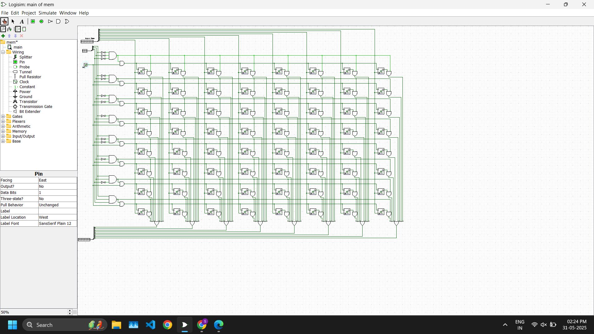

# 8×8 RAM Memory Array (Logisim)

This project implements an 8×8 RAM memory array from scratch using **Logisim**. It demonstrates the fundamentals of memory design including decoding logic, write-enable control, and data storage and retrieval.

## 📁 Project Description

- **Storage Capacity**: 8 words × 8 bits per word
- **Address Width**: 3 bits (selects one of 8 rows)
- **Data Width**: 8 bits
- **Access Type**: Synchronous write using a write-enable (WE) signal
- **Tools Used**: Logisim (https://github.com/reds-heig/logisim-evolution)

This is a basic implementation of RAM which emulates how memory blocks work at the transistor and gate level in hardware.

## 🧠 Features

- Manual 3-to-8 **row decoder**
- Byte-wise **write enable** control
- **D flip-flop** based bit storage
- Support for **manual write and readback**
- Organized in a **grid-style 2D array** to mimic SRAM structures

## 🛠 Circuit Overview

- **Inputs**:
  - `Address[2:0]` → Selects memory row
  - `Data[7:0]` → Data to be written
  - `WE` → Write Enable (high for write, low for read)
- **Outputs**:
  - `DataOut[7:0]` → Read data from selected row
- **Clocked** storage using edge-triggered flip-flops

## 🐞 Issues and Bugs Resolved

- Address decoder initially had MSB/LSB bit order confusion — **fixed** in the current version.
- Ensure the splitter is wired correctly: `Bit 0` must represent **LSB** of address.

## 🖥️ Running the Project

1. Open the project using Logisim (recommend using **Logisim Evolution**).
2. Load the circuit file: `mem.circ` or `main.circ`.
3. Set inputs (address, WE, data) and **toggle clock** for writing.
4. Set WE=0 and change address to read stored data.

## 📸 Screenshots

## 📚 Future Plans

- Expand to 16×8 or 16×16 RAM
- Add asynchronous read support
- Implement using LTspice for CMOS-level simulation

## 👨‍💻 Author

Sarthak Aggarwal  
ECE, DTU — Passionate about VLSI, Memory Design, and System Architecture  
📧 sarthakaggarwal30102003@gmail.com  
🔗 [LinkedIn](https://www.linkedin.com/in/your-profile/)

---

*This repository is for academic and demonstration purposes. Feedback and contributions are always welcomed!*

